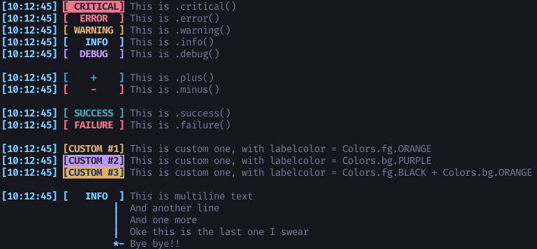

# Cool logs
 Simple output beautifier for python 3

## Usage
There are 7 different modes:
* Critical - for VERY important messages (red background and default foreground)
* Error - for errors and stuff (red foreground)
* Warning - you guessed it: for warnings (orange foreground)
* Log - for defaulft logging (blue foreground)
* New - when you discovered something new (green foreground)
* Success - for bragging about success (green foreground)  
* Custom - Set it how you like (custom type and color)

Each message will be prefixed with time when it was sent (hh:mm:ss) and it's type. Keep in mind that colors might differ on different systems or might not work at all.

